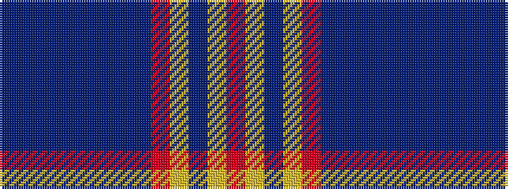

BBBBBBBBRYBYR

It is a 13 stripe tartan.

<figure class="pat-woven">

<figcaption>idealised sample</figcaption>
</figure>

## Colour Sequence



## Tartans with this colour sequence

| Tartans |
|---------------|
| [Kinnaird (1984)](/setts/s13/do17do3do2do1do1do1do1do1r3lo2do1lo2r1~x4/)|
||
