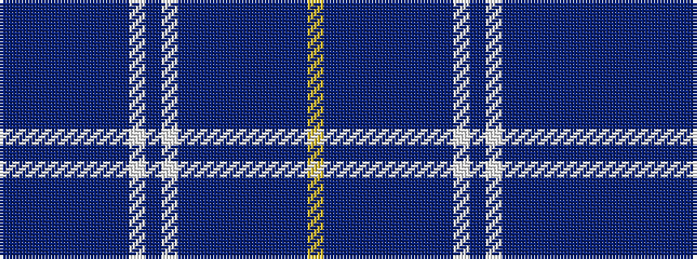

BBBBBBBBWBWBBBBBBBBY

It is a 20 stripe tartan.

<figure class="pat-woven">

<figcaption>idealised sample</figcaption>
</figure>

## Colour Sequence



## Tartans with this colour sequence

| Tartans |
|---------------|
| [Kilmarnock Football Club (2005)](/setts/s20/db28db11db8db15dp3db3dp3db4w3db4w3db4dp3db3dp3db15db8db11db28ly2~x2/)|
||
