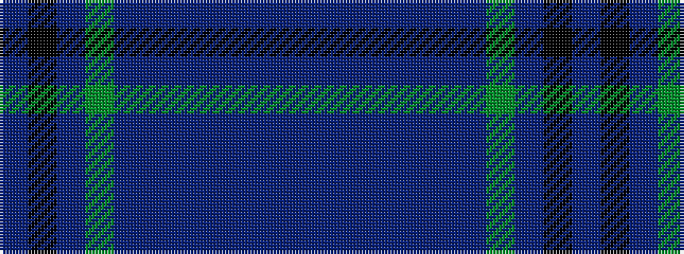

BBBBBBBGBKB

It is a 11 stripe tartan.

<figure class="pat-woven">

<figcaption>idealised sample</figcaption>
</figure>

## Colour Sequence



## Tartans with this colour sequence

| Tartans |
|---------------|
| [Spirit of Scotland (Corporate)](/setts/s11/db96dp8db12db3db3db3db3dg20dp8k3dp14~x2/)|
||
