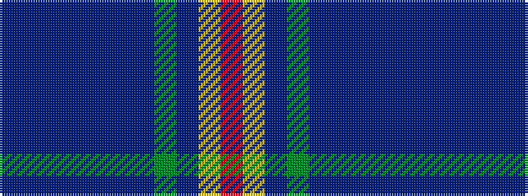

BBBBBBBGBYR

It is a 11 stripe tartan.

<figure class="pat-woven">

<figcaption>idealised sample</figcaption>
</figure>

## Colour Sequence



## Tartans with this colour sequence

| Tartans |
|---------------|
| [San Diego Tartan Day (Corporate)](/variants/s11/n2db16t2db3t2db3t8g30db3ly2r2~x2/)|
||
