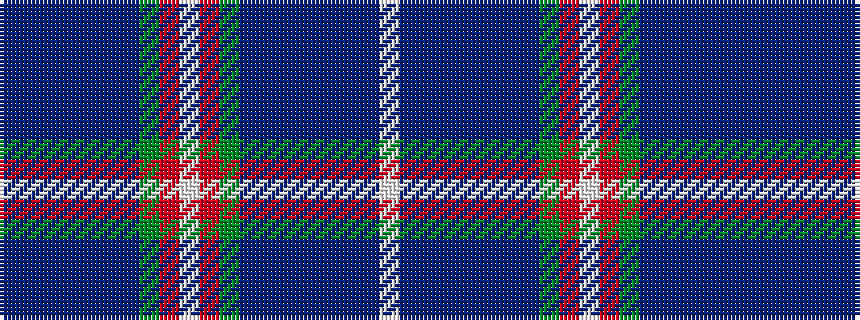

BBBBBBBGRWRGBBBBBBBW

It is a 20 stripe tartan.

<figure class="pat-woven">

<figcaption>idealised sample</figcaption>
</figure>

## Colour Sequence



## Tartans with this colour sequence

| Tartans |
|---------------|
| [Inverclyde](/setts/s20/db5dbi2db9n10t2n4t2g10r33w2r33g10t2n4t2n10db9dbi2db5w3~x2/)|
||
