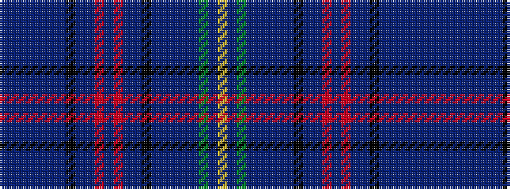

BBBBBBBKBBRBRBBKBBBBBGBY

It is a 24 stripe tartan.

<figure class="pat-woven">

<figcaption>idealised sample</figcaption>
</figure>

## Colour Sequence



## Tartans with this colour sequence

| Tartans |
|---------------|
| [RAF Kinloss](/variants/s24/dt5db6dt8n50dt4n4dt4k8n8dt44m4dt10m4dt44n8k8dt4n4dt4n50dt8dg6dt5ly4/)|
||
