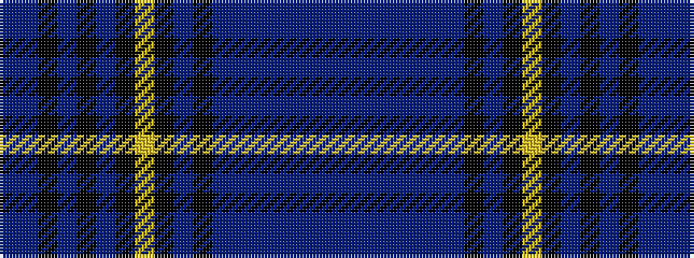

BBBBBBBKBKYKBKBKBB

It is a 18 stripe tartan.

<figure class="pat-woven">

<figcaption>idealised sample</figcaption>
</figure>

## Colour Sequence



## Tartans with this colour sequence

| Tartans |
|---------------|
| [Royal Canadian Air Force](/variants/s18/dr4b6k1dr2k1b14k3lr3k2dr2k2dr2db4dr2db6dr2db6dr3/)|
||
