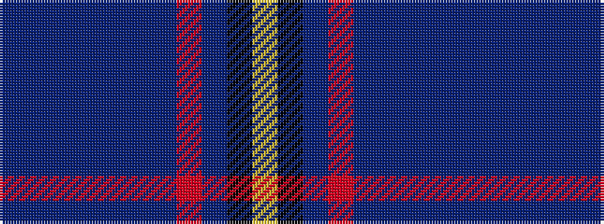

BBBBBBBRBKY

It is a 11 stripe tartan.

<figure class="pat-woven">

<figcaption>idealised sample</figcaption>
</figure>

## Colour Sequence



## Tartans with this colour sequence

| Tartans |
|---------------|
| [Lieuwen, Jeffrey Pascal (Personal)](/setts/s11/dp10db1dp2db1b1db1b2m2b1k1ly2~x10/)|
||
