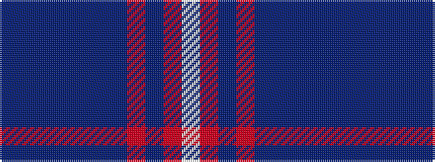

BBBBBBBRBRW

It is a 11 stripe tartan.

<figure class="pat-woven">

<figcaption>idealised sample</figcaption>
</figure>

## Colour Sequence



## Tartans with this colour sequence

| Tartans |
|---------------|
| [United Scots American](/setts/s11/dp3dt12db2dt2db11dp2db11r2db2r10w3~x2/)|
||
