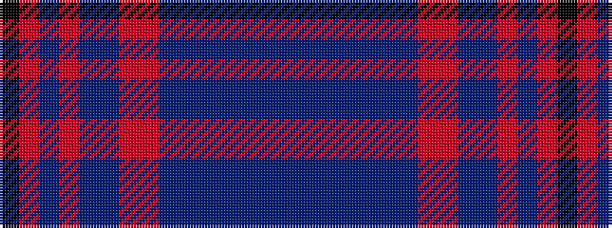

BBBBBBBRRBBRBRK

It is a 15 stripe tartan.

<figure class="pat-woven">

<figcaption>idealised sample</figcaption>
</figure>

## Colour Sequence



## Tartans with this colour sequence

| Tartans |
|---------------|
| [Strathdon District Tartan](/variants/s15/k3o8do2o8dt11do2o4oi4do27dt1do2dt2do2dt13do3~x2/)|
||
