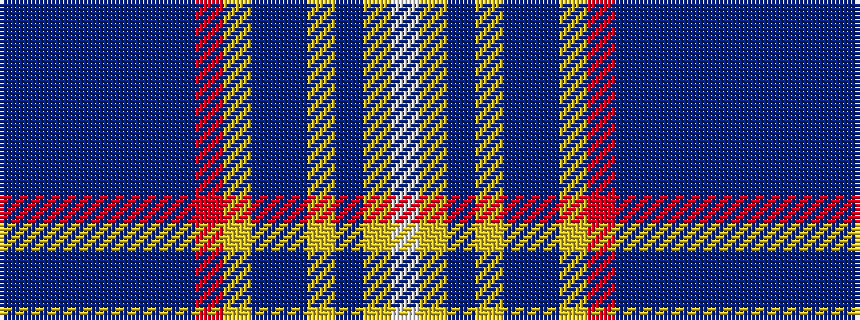

BBBBBBBRYBBYBYW

It is a 15 stripe tartan.

<figure class="pat-woven">

<figcaption>idealised sample</figcaption>
</figure>

## Colour Sequence



## Tartans with this colour sequence

| Tartans |
|---------------|
| [Strathdon](/variants/s15/w3lo8dpi2lo8dp11dpi2lo4o4dpi27dp1dpi2dp2dpi2dp13dpi2~x2/)|
||
