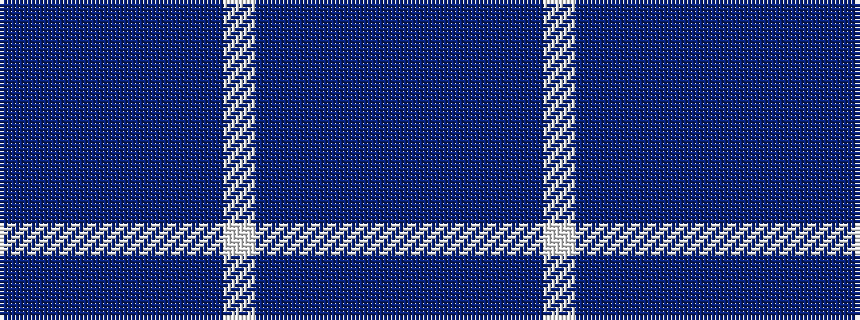

BBBBBBBWBBBBB

It is a 13 stripe tartan.

<figure class="pat-woven">

<figcaption>idealised sample</figcaption>
</figure>

## Colour Sequence



## Tartans with this colour sequence

| Tartans |
|---------------|
| [Poulter Sandwich](/setts/s13/dp69b14dp13b14dp13b69db72lb13db72b69dp68b14dp13/)|
||
| [Poulter Sandwich](/setts/s13/dp35b7dp7b7dp7b35dt36lb7dt36b35dp35b7dp7/)|
||
