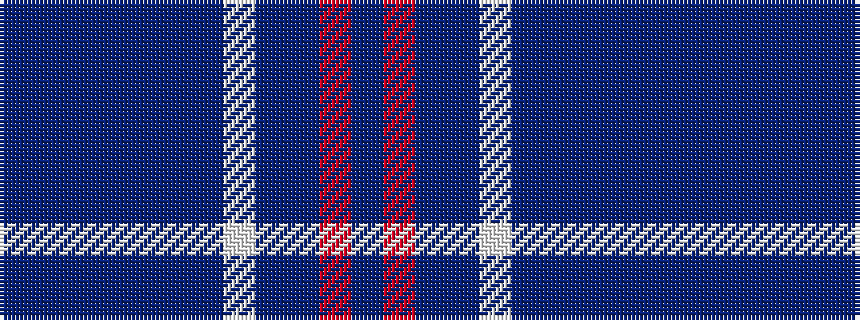

BBBBBBBWBBRB

It is a 12 stripe tartan.

<figure class="pat-woven">

<figcaption>idealised sample</figcaption>
</figure>

## Colour Sequence



## Tartans with this colour sequence

| Tartans |
|---------------|
| [Caledonian Club](/variants/s12/b24db4b4db4b4db20n32w4n32db35r5db4/)|
||
