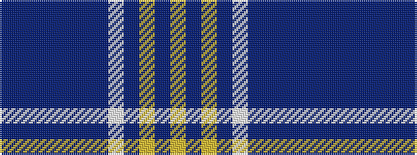

BBBBBBBWBYBY

It is a 12 stripe tartan.

<figure class="pat-woven">

<figcaption>idealised sample</figcaption>
</figure>

## Colour Sequence



## Tartans with this colour sequence

| Tartans |
|---------------|
| [Deuchars IPA (Corporate)](/variants/s12/dt45b3dt3b15dt3b3dt7w1dt7lo1dt1lo1~x2/)|
||
