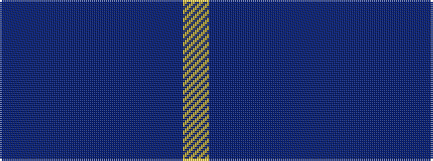

BBBBBBBY

It is a 8 stripe tartan.

<figure class="pat-woven">

<figcaption>idealised sample</figcaption>
</figure>

## Colour Sequence



## Tartans with this colour sequence

| Tartans |
|---------------|
| [Edinburgh Monarchs](/setts/s8/dt5db4dr1db14dt14dr1dt5lo3~x2/)|
||
| [Marist School, The](/setts/s8/db29dbi2db1dbi1db1dbi1t8lo1~x4/)|
||
| [Marist School, The](/setts/s8/dt29b2dt1b1dt1b1db8ly1~x4/)|
||
