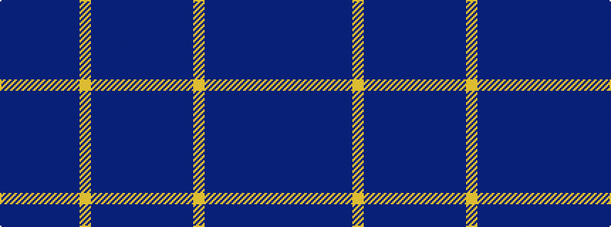

BBBBBBBYBBBBB

It is a 13 stripe tartan.

<figure class="pat-woven">

<figcaption>idealised sample</figcaption>
</figure>

## Colour Sequence



## Tartans with this colour sequence

| Tartans |
|---------------|
| [Adair (Name)](/variants/s13/t16db2t2db2t2db16dbi16ly3dbi16db16t16db2t2~x2/)|
||
| [Poulter, Blue (Corprate)](/variants/s13/b25db4b4db4b4db23t23lr4t23db23b23db4b4~x2/)|
||
