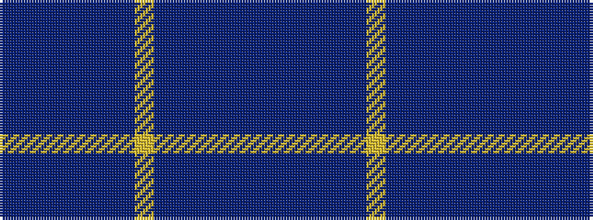

BBBBBBBYBBBBBB

It is a 14 stripe tartan.

<figure class="pat-woven">

<figcaption>idealised sample</figcaption>
</figure>

## Colour Sequence



## Tartans with this colour sequence

| Tartans |
|---------------|
| [Marist School, The Corporate Tartan](/variants/s14/db29dbi2db1dbi1db1dbi1t8lo1~x4/)|
||
