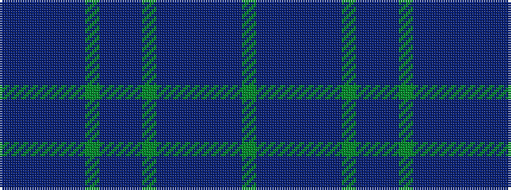

BBBBBBGBBBGBBBBBBG

It is a 18 stripe tartan.

<figure class="pat-woven">

<figcaption>idealised sample</figcaption>
</figure>

## Colour Sequence



## Tartans with this colour sequence

| Tartans |
|---------------|
| [Wicklow, County](/setts/s18/n1do1n12t1do3n1g6n2do1n2g6n1do3t1n12do1n1g1~x4/)|
||
