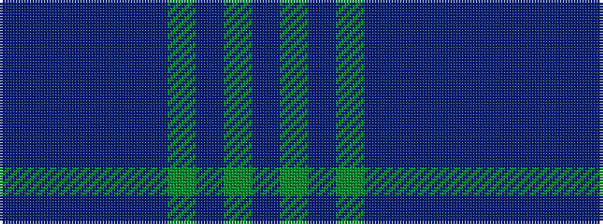

BBBBBBGBGB

It is a 10 stripe tartan.

<figure class="pat-woven">

<figcaption>idealised sample</figcaption>
</figure>

## Colour Sequence



## Tartans with this colour sequence

| Tartans |
|---------------|
| [Lang](/setts/s10/t4dp2t6dp2t10dp30g10dp2g9dp2~x2/)|
||
