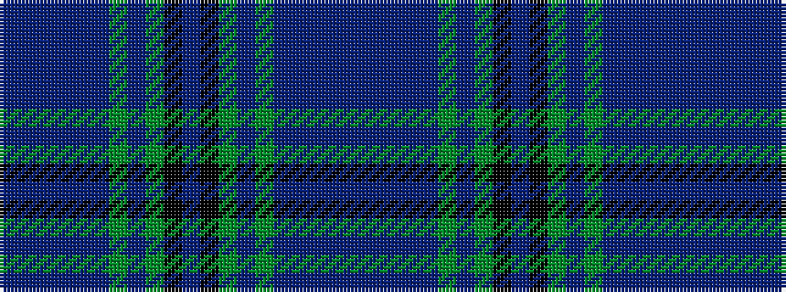

BBBBBBGBGKBKGBGBBBBB

It is a 20 stripe tartan.

<figure class="pat-woven">

<figcaption>idealised sample</figcaption>
</figure>

## Colour Sequence



## Tartans with this colour sequence

| Tartans |
|---------------|
| [Heartlands Fancy Tartan Tartan Number: 3443. Earliest known date: 2002 Designed by Erica Randall of House of Edgar for MacGregor & MacDuff of 41 Bath Street, Glasgow G2 1HW for use in their kilt hire business. The customer requested that the tartan be based upon the Melville sett. Date of application 6th November 2002. In May 2003 the business was sold by Mr Robert Brown who elected to retain the copyright of this tartan. See products available Copyright © Blair Urquhart, Comrie, 2015](/setts/s20/db4b1dt20db2dt2db18dg2db2dg22k2dp4~x2/)|
|![Heartlands Fancy Tartan Tartan Number: 3443. Earliest known date: 2002 Designed by Erica Randall of House of Edgar for MacGregor & MacDuff of 41 Bath Street, Glasgow G2 1HW for use in their kilt hire business. The customer requested that the tartan be based upon the Melville sett. Date of application 6th November 2002. In May 2003 the business was sold by Mr Robert Brown who elected to retain the copyright of this tartan. See products available Copyright © Blair Urquhart, Comrie, 2015 example sett](/setts/s20/db4b1dt20db2dt2db18dg2db2dg22k2dp4~x2/sett.png)|
