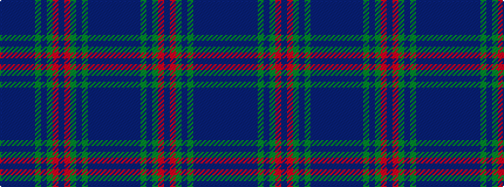

BBBBBBGBGRBRGBGBBBBB

It is a 20 stripe tartan.

<figure class="pat-woven">

<figcaption>idealised sample</figcaption>
</figure>

## Colour Sequence



## Tartans with this colour sequence

| Tartans |
|---------------|
| [Heartlands](/variants/s20/db4b1dt20db2dt2db18dg2db2dg22m2dp4~x2/)|
||
