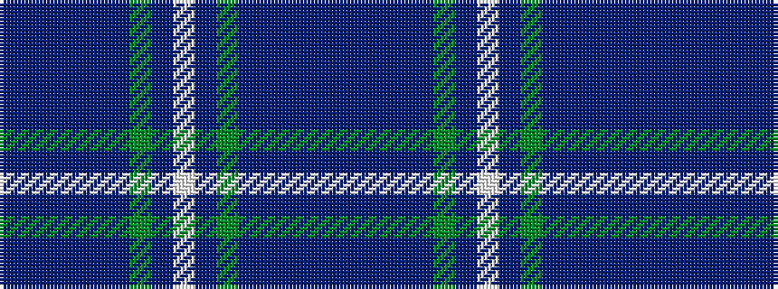

BBBBBBGBWBGBBBBB

It is a 16 stripe tartan.

<figure class="pat-woven">

<figcaption>idealised sample</figcaption>
</figure>

## Colour Sequence



## Tartans with this colour sequence

| Tartans |
|---------------|
| [Forbes of Druminnor Artifact Tartan Tartan Number: 592. Earliest known date: 1968 Inspired by an old rug belonging to Hon. Peggy Forbes Semphill. A sample was woven by A Stewart while acting as Director of Research at the Scottish Tartans Society in 1968. See products available Copyright © Blair Urquhart, Comrie, 2015](/setts/s16/db6dri2db2dri2db2do6g8do1w2do1g8dr2do4db8dri2db2~x2/)|
||
