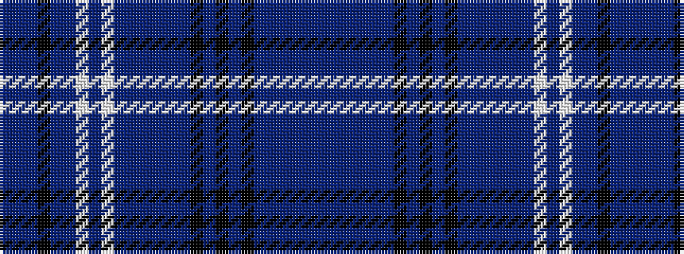

BBBBBBKBKBKBBBBBBWBWBBKBBB

It is a 26 stripe tartan.

<figure class="pat-woven">

<figcaption>idealised sample</figcaption>
</figure>

## Colour Sequence



## Tartans with this colour sequence

| Tartans |
|---------------|
| [Round Table](/setts/s26/t11db2t11k2db2t5w2t5w2t5db10t1db2t1db10k4t5k2t5k4db2t2db2t11db2t1~x2/)|
||
