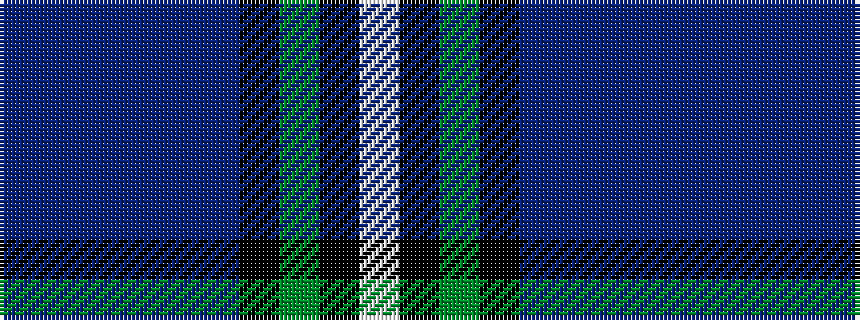

BBBBBBKGKW

It is a 10 stripe tartan.

<figure class="pat-woven">

<figcaption>idealised sample</figcaption>
</figure>

## Colour Sequence



## Tartans with this colour sequence

| Tartans |
|---------------|
| [St Kentigern College](/variants/s10/b30db3b3db3b3db10k10g20k2w4~x2/)|
||
| [St. Kentigern College (Corporate)](/variants/s10/db30dbi3db3dbi3db3dbi10k10dg20k2w4~x2/)|
||
