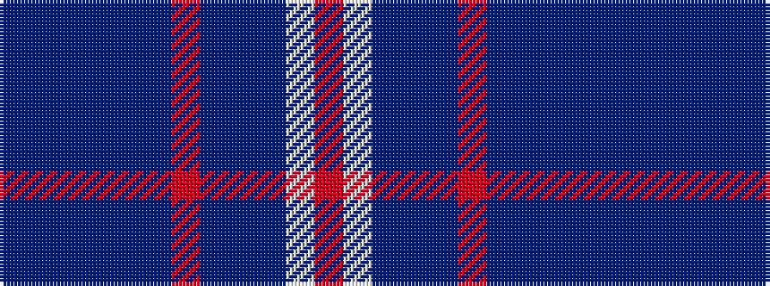

BBBBBBRBBBWR

It is a 12 stripe tartan.

<figure class="pat-woven">

<figcaption>idealised sample</figcaption>
</figure>

## Colour Sequence



## Tartans with this colour sequence

| Tartans |
|---------------|
| [Royal Navy](/variants/s12/dbi4dp8dbi3dp2dbi64t24r4db3t4db3w8r4/)|
||
