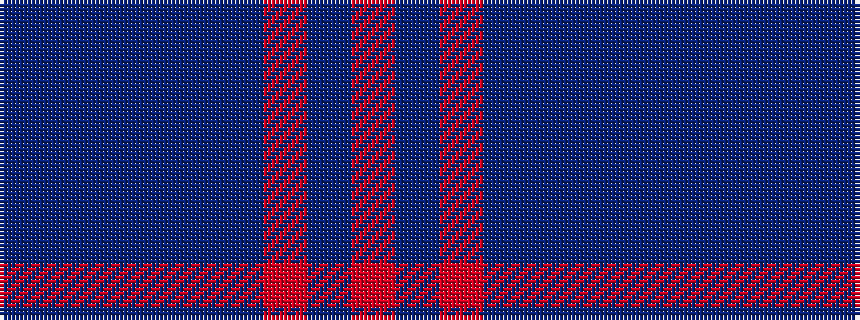

BBBBBBRBR

It is a 9 stripe tartan.

<figure class="pat-woven">

<figcaption>idealised sample</figcaption>
</figure>

## Colour Sequence



## Tartans with this colour sequence

| Tartans |
|---------------|
| [POF (Fashion)](/setts/s9/b27db8b14db8b14db26r84db6r12/)|
||
