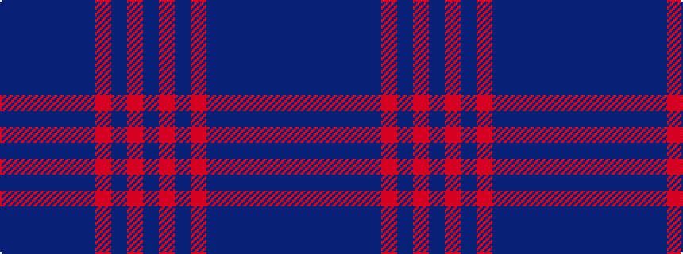

BBBBBBRBRB

It is a 10 stripe tartan.

<figure class="pat-woven">

<figcaption>idealised sample</figcaption>
</figure>

## Colour Sequence



## Tartans with this colour sequence

| Tartans |
|---------------|
| [Wcwm 1155](/setts/s10/doi7do2doi2do2doi2do6r14do2r2do2~x4/)|
||
