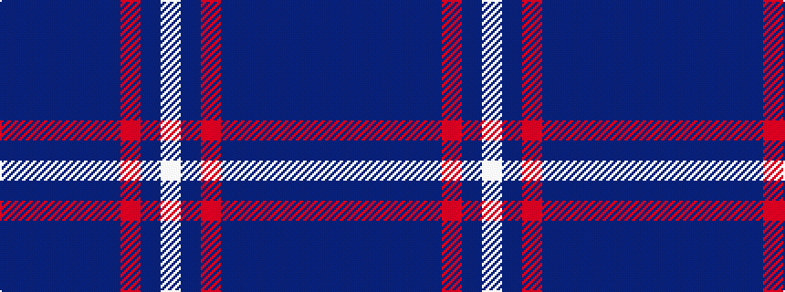

BBBBBBRBW

It is a 9 stripe tartan.

<figure class="pat-woven">

<figcaption>idealised sample</figcaption>
</figure>

## Colour Sequence



## Tartans with this colour sequence

| Tartans |
|---------------|
| [Hebridean Heather](/variants/s9/n4dt2n7dti30n8dti7r5dt1w2~x2/)|
||
