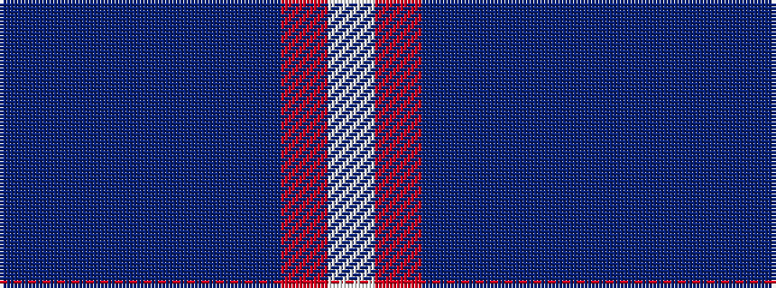

BBBBBBRW

It is a 8 stripe tartan.

<figure class="pat-woven">

<figcaption>idealised sample</figcaption>
</figure>

## Colour Sequence



## Tartans with this colour sequence

| Tartans |
|---------------|
| [Queen of the South F.C. (Sports)](/variants/s8/lb6r16dt20db18t5db18n6db4/)|
||
