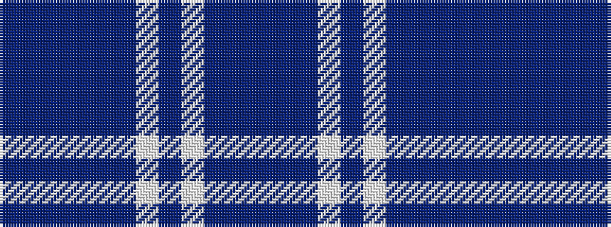

BBBBBBWBWBBB

It is a 12 stripe tartan.

<figure class="pat-woven">

<figcaption>idealised sample</figcaption>
</figure>

## Colour Sequence



## Tartans with this colour sequence

| Tartans |
|---------------|
| [Harmony](/setts/s12/dbi11t3dbi4lb3dbi3lb4dbi3db13b34n3b4dbi3~x2/)|
||
