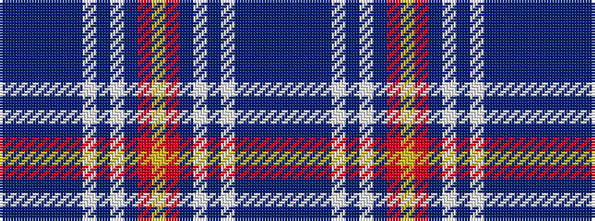

BBBBBBWBWBRYRBWBWBBBB

It is a 21 stripe tartan.

<figure class="pat-woven">

<figcaption>idealised sample</figcaption>
</figure>

## Colour Sequence



## Tartans with this colour sequence

| Tartans |
|---------------|
| [Tartan Army](/setts/s21/b22db2b4db2b4db8w2db2w2db10r5ly2r5db10w2db2w2db8b18db2b4~x2/)|
||
| [Tartan Army Corporate/Sport Tartan Tartan Number: 2389. Earliest known date: 1997 A tartan designed for the Scottish football supporters at the 1997 World Cup. The supporters were affectionately known as the Tartan Army. A strick code of conduct earned the supporters praise worldwide. See products available Copyright © Blair Urquhart, Comrie, 2015](/setts/s21/db22dt2db4dt2db4dt8w2dt2w2dt10r5ly2r5dt10w2dt2w2dt8db18dt2db4~x2/)|
||
