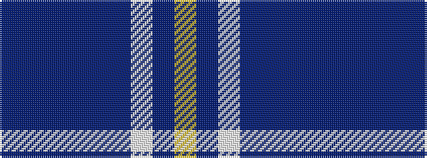

BBBBBBWBY

It is a 9 stripe tartan.

<figure class="pat-woven">

<figcaption>idealised sample</figcaption>
</figure>

## Colour Sequence



## Tartans with this colour sequence

| Tartans |
|---------------|
| [Romantic Scotland (Madonna)](/variants/s9/dt5dp1dt4db4dt7db8w1db2ly1~x4/)|
||
