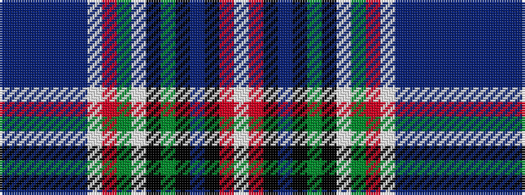

BBBBBBWRGWKGKBKRW

It is a 17 stripe tartan.

<figure class="pat-woven">

<figcaption>idealised sample</figcaption>
</figure>

## Colour Sequence



## Tartans with this colour sequence

| Tartans |
|---------------|
| [Reeves (2015)](/variants/s17/db36t2db4t3db4t4w1r2g2w1k2g3k2db3k2r3w1~x2/)|
||
