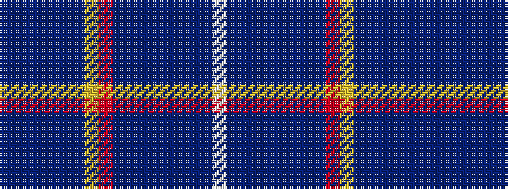

BBBBBBYRBBBBBBBW

It is a 16 stripe tartan.

<figure class="pat-woven">

<figcaption>idealised sample</figcaption>
</figure>

## Colour Sequence



## Tartans with this colour sequence

| Tartans |
|---------------|
| [Spirit of Romania](/setts/s16/dp4db1dp2db1b16db1ly16r16db1b4db2b4db2b12db1w4~x2/)|
||
