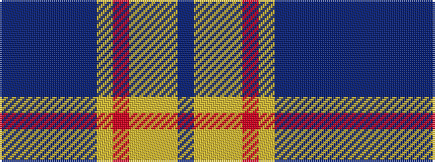

BBBBBBYRYYYB

It is a 12 stripe tartan.

<figure class="pat-woven">

<figcaption>idealised sample</figcaption>
</figure>

## Colour Sequence



## Tartans with this colour sequence

| Tartans |
|---------------|
| [Ralston (UK)](/setts/s12/t18dt3t10dt3t10dt14lo2r7lo2lg14lo2dt14~x2/)|
||
