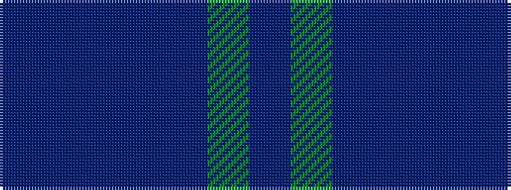

BBBBBGB

It is a 7 stripe tartan.

<figure class="pat-woven">

<figcaption>idealised sample</figcaption>
</figure>

## Colour Sequence



## Tartans with this colour sequence

| Tartans |
|---------------|
| [Pringle, James (Fashion)](/setts/s7/db20dp2db3dp2db14g18db4~x2/)|
||
