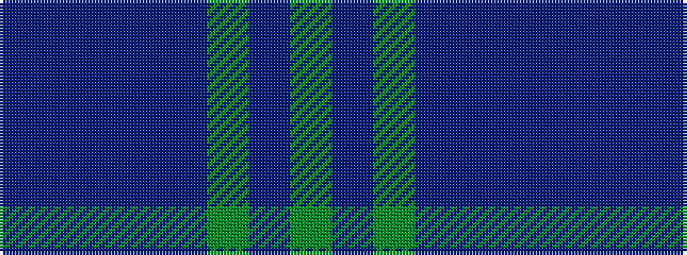

BBBBBGBG

It is a 8 stripe tartan.

<figure class="pat-woven">

<figcaption>idealised sample</figcaption>
</figure>

## Colour Sequence



## Tartans with this colour sequence

| Tartans |
|---------------|
| [Chindecella Ruadh (Kemete Heil)](/variants/s8/dr9do4dr4do4dr24dy19do19dy4~x2/)|
||
