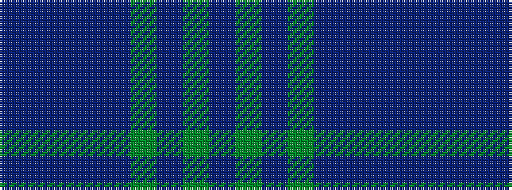

BBBBBGBGB

It is a 9 stripe tartan.

<figure class="pat-woven">

<figcaption>idealised sample</figcaption>
</figure>

## Colour Sequence



## Tartans with this colour sequence

| Tartans |
|---------------|
| [Begg (Personal)](/setts/s9/p4gi30dbi12g3db2t3db26dp4db2/)|
||
