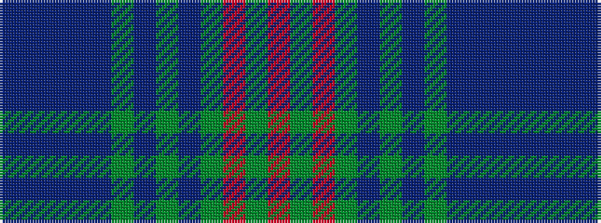

BBBBBGBGBGRGR

It is a 13 stripe tartan.

<figure class="pat-woven">

<figcaption>idealised sample</figcaption>
</figure>

## Colour Sequence



## Tartans with this colour sequence

| Tartans |
|---------------|
| [International Cricket Council](/setts/s13/b33db4b3db4b7dg2b2dg2b2dg16r2dg2r2~x2/)|
||
