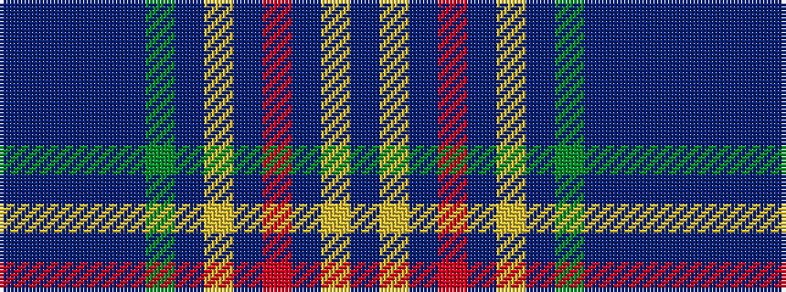

BBBBBGBYBRBYB

It is a 13 stripe tartan.

<figure class="pat-woven">

<figcaption>idealised sample</figcaption>
</figure>

## Colour Sequence



## Tartans with this colour sequence

| Tartans |
|---------------|
| [Pitcairn Heritage Htg (Name)](/variants/s13/p3b3p3b3p3g22b2ly2b22r5p8ly2b2~x2/)|
||
| [Pitcairn Hunting Corporate Tartan](/variants/s13/p3n3p3n3p3g23n2ly2n23r6p8ly2n2~x2/)|
||
