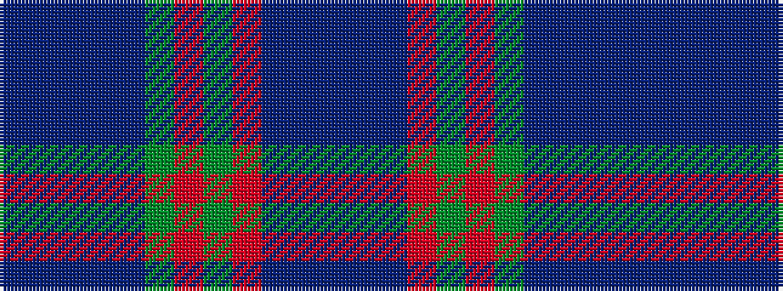

BBBBBGRGRBBB

It is a 12 stripe tartan.

<figure class="pat-woven">

<figcaption>idealised sample</figcaption>
</figure>

## Colour Sequence



## Tartans with this colour sequence

| Tartans |
|---------------|
| [Doane](/setts/s12/p3dt1do3o8dg4o3dg17do11db6do4db21dt1~x2/)|
||
