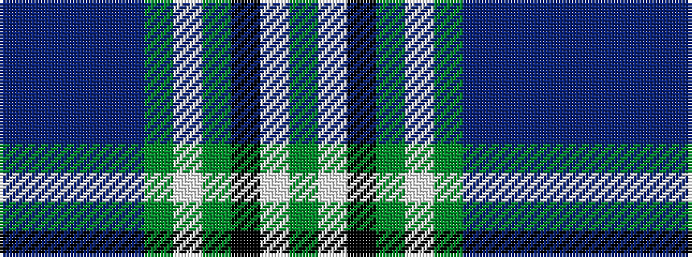

BBBBBGWGKWG

It is a 11 stripe tartan.

<figure class="pat-woven">

<figcaption>idealised sample</figcaption>
</figure>

## Colour Sequence



## Tartans with this colour sequence

| Tartans |
|---------------|
| [Spirit of West Lothian](/setts/s11/dt48dp2dt5dp2dt7g2w3g5k4w1g26~x2/)|
||
