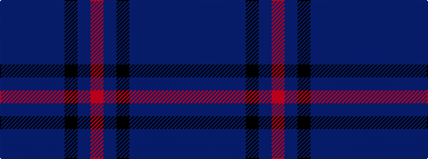

BBBBBKBR

It is a 8 stripe tartan.

<figure class="pat-woven">

<figcaption>idealised sample</figcaption>
</figure>

## Colour Sequence



## Tartans with this colour sequence

| Tartans |
|---------------|
| [Little Hunting](/variants/s8/dbi5db3dbi4db3dbi4k28dbi8r1~x2/)|
||
