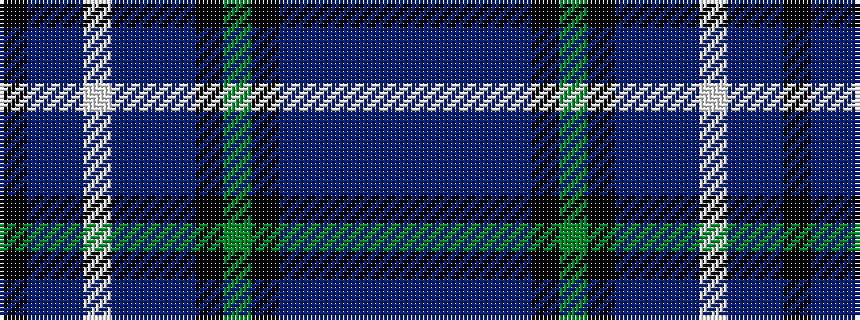

BBBBBKGKBBBWBBK

It is a 15 stripe tartan.

<figure class="pat-woven">

<figcaption>idealised sample</figcaption>
</figure>

## Colour Sequence



## Tartans with this colour sequence

| Tartans |
|---------------|
| [Causeway, The (District)](/setts/s15/dt38n8db3dt20n42k2g6k2n2dp3n2w2db10n2k6/)|
||
