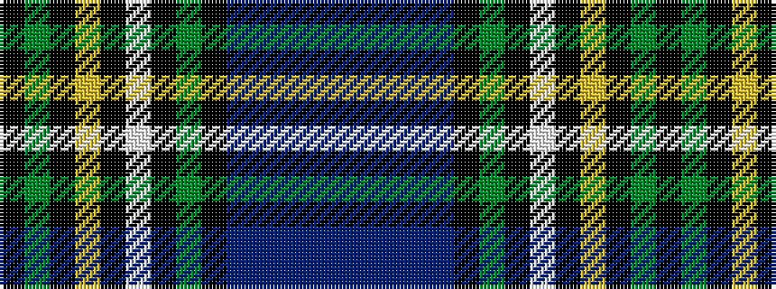

BBBBBKGKWKYKGK

It is a 14 stripe tartan.

<figure class="pat-woven">

<figcaption>idealised sample</figcaption>
</figure>

## Colour Sequence



## Tartans with this colour sequence

| Tartans |
|---------------|
| [Shandon (Personal)](/variants/s14/k20g18k2ly2k5w2k2g18k20dp18b4dp4b4dp18~x2/)|
||
