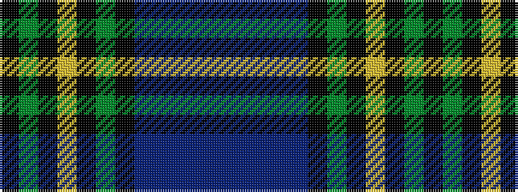

BBBBBKGKYKGK

It is a 12 stripe tartan.

<figure class="pat-woven">

<figcaption>idealised sample</figcaption>
</figure>

## Colour Sequence



## Tartans with this colour sequence

| Tartans |
|---------------|
| [Price-Powell (Personal)](/setts/s12/k14dg14k8lo4k4dg14k14db14p5db4p5db14~x2/)|
||
| [Price-Powell (Personal)](/setts/s12/k14g14k8ly4k4g14k14db14dp5db4dp5db14~x2/)|
||
