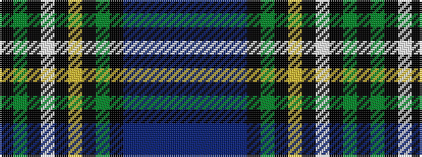

BBBBBKGKYKWKGK

It is a 14 stripe tartan.

<figure class="pat-woven">

<figcaption>idealised sample</figcaption>
</figure>

## Colour Sequence



## Tartans with this colour sequence

| Tartans |
|---------------|
| [Shandon (Personal)](/variants/s14/k20g18k2w2k5ly2k2g18k20db18b4db4b4db18~x2/)|
||
