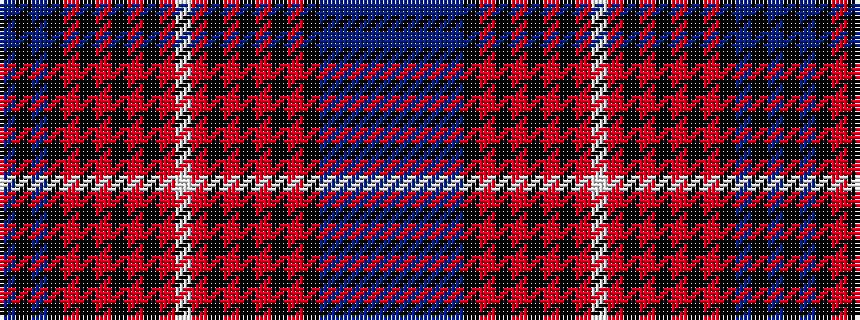

BBBBBKRKRKRKRWRKRKRKRKBKB

It is a 25 stripe tartan.

<figure class="pat-woven">

<figcaption>idealised sample</figcaption>
</figure>

## Colour Sequence



## Tartans with this colour sequence

| Tartans |
|---------------|
| [Arran, Isle of (Strathmore)](/variants/s25/dp86n4dp4n4dp4k16r2k4r3k3r4k2r6w3r6k2r4k3r3k4r2k16n24k4n10~x2/)|
||
