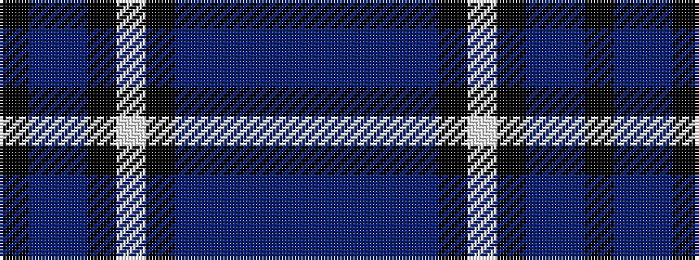

BBBBBKWKBBK

It is a 11 stripe tartan.

<figure class="pat-woven">

<figcaption>idealised sample</figcaption>
</figure>

## Colour Sequence



## Tartans with this colour sequence

| Tartans |
|---------------|
| [Clergy "Two Spirit" (Personal)](/setts/s11/k1t1db6k6lp1k6t1db2t1db3t1~x2/)|
||
