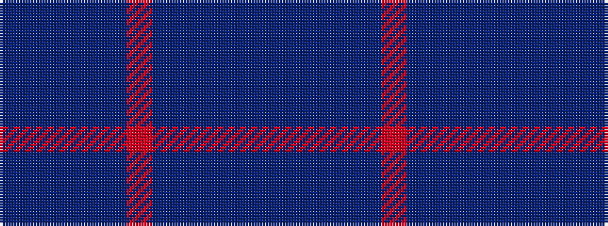

BBBBBRBBBBB

It is a 11 stripe tartan.

<figure class="pat-woven">

<figcaption>idealised sample</figcaption>
</figure>

## Colour Sequence



## Tartans with this colour sequence

| Tartans |
|---------------|
| [Paul Henry (Personal)](/setts/s11/n4dt3n7db9n13r2n13dt9n7db3n4~x2/)|
||
